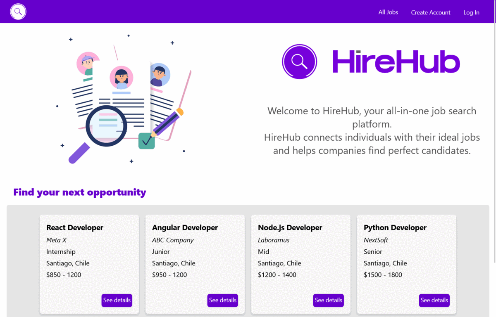
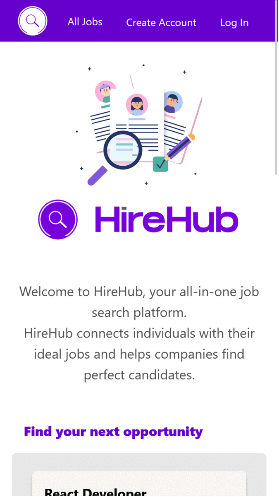

# HireHub - Job Search Platform

## Project Overview

**[HireHub](https://hirehub.vercel.app/)** is a user-friendly job search platform designed to seamlessly connect talented job seekers with exceptional companies. The platform streamlines the hiring process for both applicants and recruiters, providing a feature-rich environment for efficient job matching.

## Key Features

### User Account Options

- **"I'm looking for a job"**: Empowers users to explore job opportunities and directly submit their resumes to companies.
- **"I'm looking for talent"**: Enables recruiters to post job listings and efficiently manage applications.

### Job Search and Application

- **Effortless Job Exploration:**
  - Job seekers can effortlessly navigate through a diverse range of available positions, making it simple to find their ideal job match.

- **Streamlined CV Submission:**
  - The platform offers a seamless process for submitting resumes directly to hiring companies, ensuring a smooth and efficient application experience.

- **Intuitive Application Management:**
  - Users enjoy easy access to their history of submitted applications, facilitating quick and efficient management and control over their job-seeking journey.

### Recruiter Dashboard

- **User-Friendly Dashboard:**
  - Recruiters can efficiently post job listings and manage applications through an intuitive interface.

- **Email Notifications:**
  - Recruiters receive timely email notifications when a new application is received, ensuring prompt responses.

### User Profile Management

- **Profile Access:**
  - Users have the ability to easily access and view their personalized profiles.

- **Personal Information Updates:**
  - Empowering users with control, they can conveniently update and modify their name and password through a straightforward process.

### Account Deletion

- **User Autonomy:**
  - Users have the autonomy to delete their accounts when needed.

- **Straightforward Process:**
  - This feature provides a straightforward process for users who wish to remove their profile and associated data from HireHub.

## User Interface

HireHub boasts a clean and intuitive interface, providing users with a seamless navigation experience. The design prioritizes simplicity, ensuring that users can effortlessly explore job opportunities and manage their applications.

**Fully Responsive Design:**
HireHub is crafted with a fully responsive design, ensuring optimal user experience across various devices and screen sizes.

Whether you're a job seeker looking for the perfect opportunity or a recruiter searching for top talent, HireHub's visually appealing and well-organized interface is designed to enhance your overall user experience.

## Technology Stack

- **Frontend Framework**: [React](https://reactjs.org/) with [TypeScript](https://www.typescriptlang.org/)
  - Utilizes React Hooks and Context API to enhance component logic and state management.
  - Leverages TypeScript for static typing, providing improved code reliability and developer productivity.

- **Styling Framework**: [Tailwind CSS](https://tailwindcss.com/)
  - Employs Tailwind CSS for a utility-first approach to styling, offering a highly customizable and responsive design.
  - Takes advantage of Tailwind's responsive classes to ensure a seamless user experience across various screen sizes.

- **Form and Icons**: [Material-UI](https://material-ui.com/)
  - Integrates Material-UI for streamlined form components and a library of icons, enhancing the overall visual consistency and user interface.

## Developers

This project was designed by Andressa Rodrigues.
